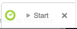
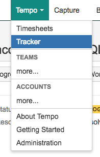
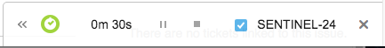
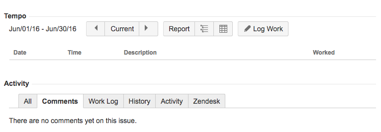

# Time Tracking

We use [Tempo](https://marketplace.atlassian.com/plugins/is.origo.jira.tempo-plugin/cloud/overview), a Jira addon,
to track time against tasks.

## Timers

When a task is open, you will see a timer in the lower right corner of the browser.

If you don't see the timer, you can toggle it on and off by using the `Tempo` selection from the primary navigation.
Click the `Tracker` link to toggle lower right timer widget on and off.

Once you start a timer, it will begin counting the seconds and will persist between page, and even if you close and
re-open your browser.

Once complete, you can press the stop botton on the timer and you will be prompted with the `Log Work` form.

It will pre-populate the time worked based on the timer, but you can also modify that here in the case that you may
have started the timer late or forgot to turn it off.

It should be mentioned you can also log work without the timer. There is a `Log Work` button below the attachments
section of an issue. Work logged for the current month is displayed by default below this button.

